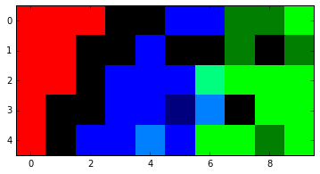

# Self-Organizing-Map

Implementation of basic SOM clustering on IRIS dataset on Python.

SOM tutorial: http://www.ai-junkie.com/ann/som/som1.html 

Dataset source: https://archive.ics.uci.edu/ml/datasets/iris

# Visualization of the clustering result:

 ```   
    Red  = Iris-Setosa
    Green = Iris-Virginica
    Blue = Iris-Versicolor
 ```


# Details of the above visual representation:

Each pixel can be said to represent a node of the SOM.

If a pixel is brightly colored it means a lot of patterns of the class 
represented by the color activates that pixel i.e that pixel is 
the best matching unit for many patterns of the same class.
    
The contrary is true too. That is, darker colored pixels are the best matching units
for only a few patterns of the class represnted by the color.
    
If a color is a mixture of two (like 'blueish-green'), then the pixel represents a 
'gray-area' i.e that pixel is best matching unit for patterns of different classes.

Black pixels are not the best matching pixels for any of the input patterns. 
