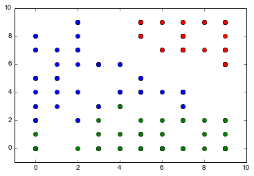

# Self-Organizing-Map

Implementation of basic SOM clustering on IRIS dataset on Python.

SOM tutorial: http://www.ai-junkie.com/ann/som/som1.html 

Dataset source: https://archive.ics.uci.edu/ml/datasets/iris

Visualization of the resultant clustering:

    
    Red  = Iris-Setosa
    Green = Iris-Virginica
    Blue = Iris-Versicolor
    

